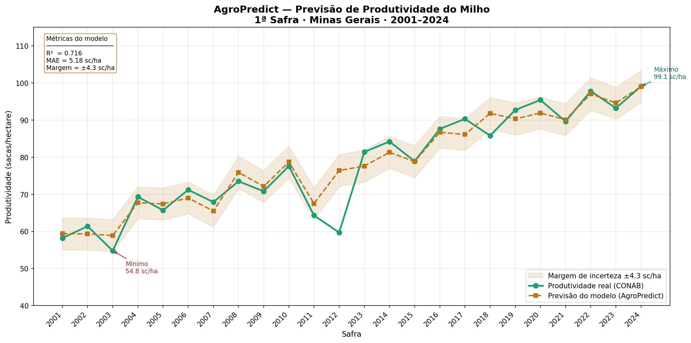

# 🌽 AgroPredict

> Modelo de Machine Learning para previsão de produtividade do milho em Minas Gerais, combinando dados climáticos reais e histórico de safras.


---

## Resultado

O modelo prevê a produtividade do milho (1ª safra · MG) com:

| Métrica | Valor |
|---------|-------|
| R² | 0.716 |
| Erro médio (MAE) | 5.18 sc/ha |
| Margem de incerteza | ±4.3 sc/ha |



---

## Contexto

O Brasil é a maior potência agrícola do mundo, e Minas Gerais é um dos principais estados produtores de milho. A previsão de produtividade é estratégica para:

- Planejamento de compra e venda de grãos
- Gestão de risco climático em seguros agrícolas
- Tomada de decisão de plantio pelo produtor

---

## Como funciona

Dados climáticos (Open-Meteo API)  +  Histórico de safras (CONAB)
        |           
        |_Exploração e limpeza dos dados (EDA)
        |
        |_Modelo de Regressão Linear (scikit-learn)
        |
        |_Previsão em sacas/hectare com intervalo de confiança


---

## Principais descobertas

- **Tendência tecnológica** explica 91.6% do crescimento de produtividade — sementes, maquinário e manejo evoluíram mais do que o clima influenciou
- **Temperatura máxima** é a variável climática mais impactante — cada +1°C reduz ~25 sc/ha no florescimento
- **Dias sem chuva** têm correlação negativa de -0.391 pontos com produtividade
- Modelo treinado com 19 safras e validado em 5 safras nunca vistas

---

## Fontes de dados

| Dado | Fonte | Descrição |

| Clima diário | [Open-Meteo](https://open-meteo.com) | 9131 dias · 2000–2024 |
| Produtividade | [CONAB](https://www.conab.gov.br) | Série histórica de safras MG |

---

## Estrutura do projeto
'''
agro-predict/
├── data/
│   ├── raw/              #dados brutos das APIs
│   └── processed/        #dados limpos e prontos
├── notebooks/
│   ├── 01_exploracao.ipynb   # EDA e processamento
│   ├── 02_modelo.ipynb       # treinamento e avaliação
│   └── 03_visualizacao.ipynb # gráfico final
├── src/
│   └── coleta.py         # coleta automática de dados
├── outputs/
│   ├── agropredict_final.png
│   └── modelo_agro_predict.pkl
└── requirements.txt

'''
---

## Como rodar

# 1. Clone o repositório
git clone https://github.com/Joao-Antonio12/agro-predict.git
cd agro-predict

# 2. Crie o ambiente virtual
python -m venv venv
venv\Scripts\activate  # Windows
source venv/bin/activate  # Mac/Linux

# 3. Instale as dependências
pip install -r requirements.txt

# 4. Colete os dados
python src/coleta.py

# 5. Execute os notebooks na ordem
# 01_exploracao.ipynb → 02_modelo.ipynb → 03_visualizacao.ipynb
```

---

## Evoluções futuras

- [ ] Dados por município em vez de média estadual
- [ ] Incluir variáveis de solo (pH, matéria orgânica)
- [ ] Testar modelos mais complexos (Random Forest, XGBoost)
- [ ] API REST para consulta de previsões em tempo real
- [ ] Dashboard interativo com Streamlit

---

## Autor

Desenvolvido por João Antonio Siqueira Pascuini  
Estudante de Ciência da Computação — UNIFAL-MG 
Estudante de Engenharia Agronômica — UNIASSELVI  

[](https://github.com/Joao-Antonio12)
[](https://www.linkedin.com/in/jo%C3%A3o-antonio-siqueira-pascuini-aa19a62b7/)